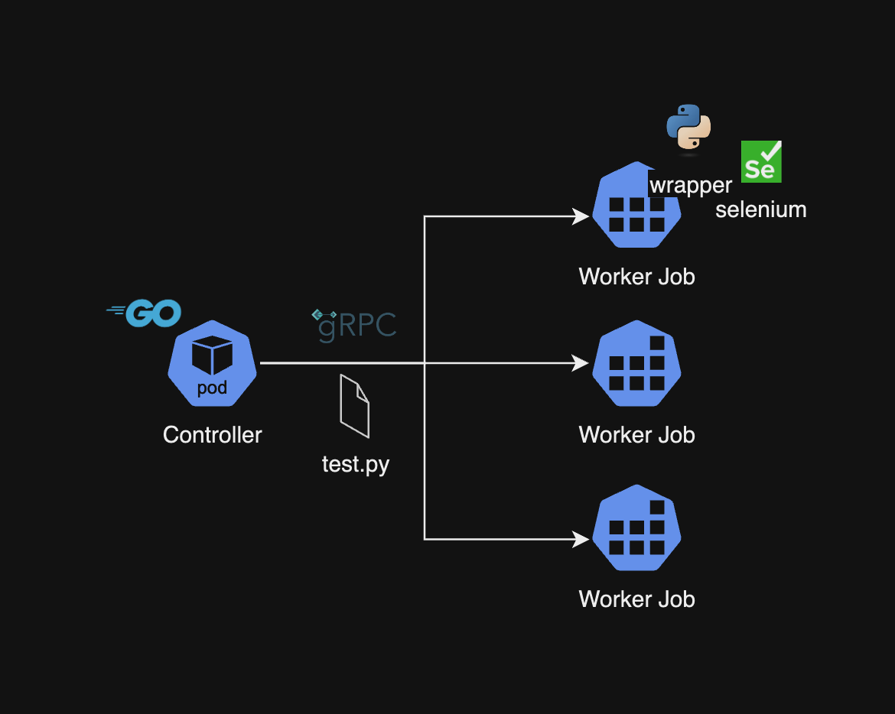
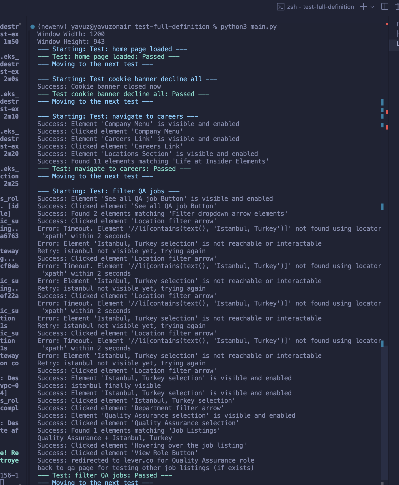
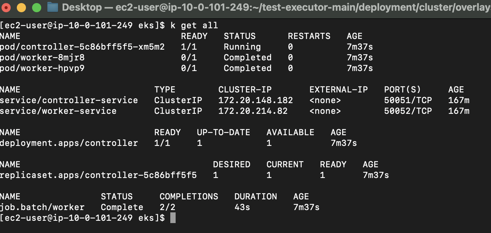
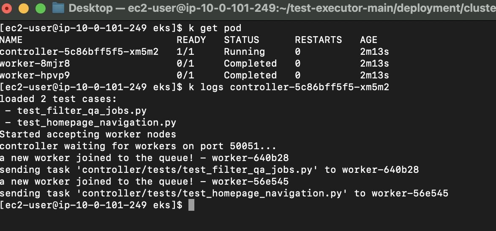
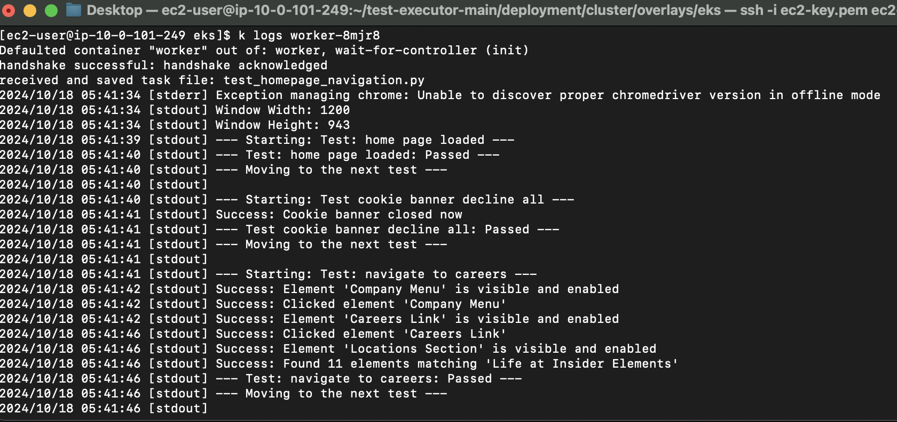
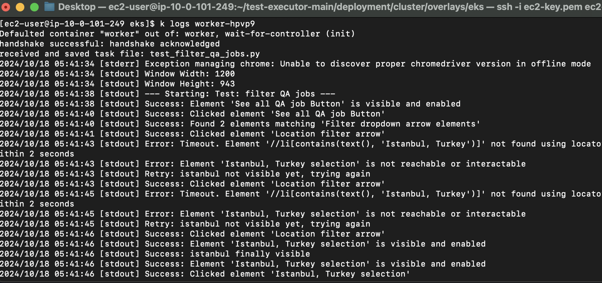
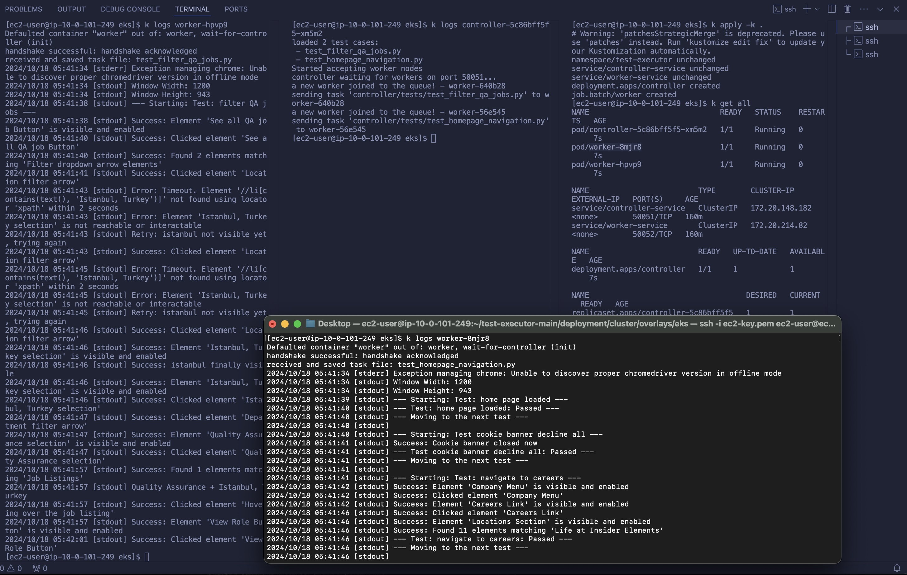

# System Architecture 

## Folder structure 

We have 4 main directories inside the project:  

```bash
test-executor/
├── controller/
│   ├── test-full-definition/
│   │   ├── insider_py_wrapper/
│   │   ├── main.py
│   ├── tests/
│   │   ├── test_homepage_navigation.py
│   │   ├── test_filter_qa_jobs.py
│   └── controller.go
│   └── Dockerfile
├── worker/
│   ├── insider_py_wrapper/
│   │   ├── generic_page.py
│   │   ├── helpers.py
│   │   ├── requirements.txt
│   └── worker.go
│   └── Dockerfile
├── testexecutor-grpc/
│   ├── TestExecutor.proto
│   ├── TestExecutor_grpc.pb.go
│   ├── TestExecutor.pb.go
├── deployment/
│   ├── terraform/
│   │   ├── cluster
│   │   ├── base/
│   │   ├── overlays/
├── go.mod
├── go.sum
├── push.sh
├── .gitignore
```

# System Overview

There're two golang separate applications using gRPC to communicate:  

- controller is the gRPC server, who is responsible for collecting selenium/python test cases from it's subdirectory "controller/tests/". 
- worker is the gRPC client, which is ran as a kubernetes job, that only is created to connect to gRPC server, receive a task, run the selenium test task with python, log it and die.

this setup allows one controller to connect to n workers simultaneously, and distribute scanned test cases using a very basic Round-Robin algorithm implementation



### Inter-pod communication
for the communication between controller and workers: when any worker is created, first it will look for a controller to bind to (this is passed as env value CONTROLLER_URL via kubernetes job yamls in the runtime). After binding, it'll initate a handshake with it's unique UUID, controller will respond to handshake and adds it to it's available_node list. 

Controller stores two slices: tasks and worker nodes 

For the service discovery in the kube network, both the controller and the workers has a ClusterIP service defined (deployment/cluster/base/controller-service/worker-service.yaml)

Controller exposes it's 51001 and ClusterIP has name: controller-service
so worker node application searches for address "controller-service:50051" to initate the handshake

--- 

# Selenium Test structure 

- Python + selenium is used for test scripts
- For better maintainability, error handling and logging,  I created a small Selenium wrapper called insider_py_wrapper
- insider_py_wrapper consists of helpers, generic_page.py class and it's built-in functions. There are comments for better explanation in the code
- The structure is drafted according to Page Object Model (POM - https://www.selenium.dev/documentation/test_practices/encouraged/page_object_models/) test files only consists of locators and steps. Rest is done via wrapper functions, so more complex logic would be kept in the wrapper library for more complex test cases

```bash
├── insider_py_wrapper/
│   │   ├── generic_page.py
│   │   ├── helpers.py
│   │   ├── requirements.txt
```

the test-full-definition folder consists a complete implementation of the tests, not related to program function, just to combine all tests. 
It can be run directly via python: 

1. install python3/pip3
2. go to controller/test-full-definiton
3. create new virtual env: > python3 -m venv ./insider_py_wrapper/env  
4. activate the env: > source ./insider_py_wrapper/env/bin/activate 
5. > pip3 install -r ./insider_py_wrapper/requirements.txt 
6. > python3 main.py 

### Sample test run




# Deployment Steps

#### Local deployment is also possible via k3d:
1. k3d registry create k3d-registry.local --port 5100
2. k3d cluster create k3s-default --agents 1 --agents-memory 3G --registry-use k3d-k3d-registry.local:5100 
3. build docker images (same as below, replace tag as beta-v14 for both images)
4. use ./push.sh to push the generated images to local registry 
5. run kustomize on overlays/k3d-local > "kubectl apply -k ." 

#### Cloud deployment:
1. Install protobuff to generate go gRPC boilerplates (takes too long to do it inside container, much faster this way)
2. Run protoc generator: 
> protoc --go_out=. --go_opt=paths=source_relative --go-grpc_out=. --go-grpc_opt=paths=source_relative TestExecutor.proto
3. Build the docker images for controller and worker from the project root folder
-  docker build -t controller:production -f ./controller/Dockerfile .
-  docker build -t worker:production -f ./worker/Dockerfile .
4. init/apply terraform from deployment/terraform directory. This will create the ECR, EC2 for kubectl, and EKS (create key for EC2 and curl own ip address - see locals)
5. Push images to ECR with deployment/terraform/push_to_ecr.sh (add ECR_URL from terraform apply output, and change the region for docker login)
6. SSH into EC2 for accessing kubectl (ssh -i "~/.ssh/my-aws-key" ec2-user@<EC2_PUBLIC_IP>) and clone the repository for kustomize YAML files ->> git clone https://github.com/yavuzakyuz/test-executor.git 
7. install kubectl, configure aws credentials to access the cluster (https://docs.aws.amazon.com/eks/latest/userguide/install-kubectl.html#linux_amd64_kubectl)
 > aws configure -> create user with defined scope on EKS & attach administrator policy
 > aws eks --region eu-north-1 update-kubeconfig --name insider-test-executer-cluster
8. go to "deployment/cluster/overlays/eks" and fix the image addresses according to newly created ECR URL for worker-local.yaml and controller-local.yaml (since I'm pushing to public, I redacted them)
9. run "kubectl apply -k ." in the overlays/eks dir, kustomize is included in kubectl so no additional install needed
10. now the controller and worker will be deployed, to change the node_count of workers, modify worker count in deployment/cluster/overlays/eks/worker-aws.yaml

* I used t3.micro instead of t2.micro, it wasn't  available in eu-north-1

# Deployment script

Since controller already does: 
- Passes the test cases from the Test Case Controller Pod to the Chrome Node Pod using inter-pod communication
- Checks if the Chrome Node Pod is ready before attempting to run the test cases.Handles error handling and retries during the deployment and test execution process.

The deployment script is only running running kustomize script: "kubectl apply -k . " inside the dir: deployment/cluster/overlays/eks
and node count can be modified in deployment/cluster/overlays/eks/worker-aws.yaml

# Logs / Demo

Cases are defined in two test scripts: test_homepage_navigation.py and test_filter_qa_jobs.py so these are ran in parallel in two nodes

### Deployment logs:



### Controller logs:



### test_homepage_navigation.py logs: 

!

### test_filter_qa_jobs.py logs: 

!

### complete logs in multiple windows: 

!

--- 


# Challenges

1-When CSS selector returns multiple elements, it may not fetch all of the elements when it's executed. Sometimes it was timing out before  required element was found  (https://stackoverflow.com/questions/22710154/python-selenium-implicit-wait-for-multiple-elements) -> Solved by creating additional function to store all elements

2- can't click on "See all Teams" : https://stackoverflow.com/a/19763087 --> solved by adding action chain move to element then perform click and Cookie banner was getting over it,

3- selenium is_displayed() doesn't work with custom select2 library for the location/department dropdown This was difficult to find -> solved by spamming clicks on the arrow until js loaded the dropdown fully, selenium functions didn't work with it as mentioned in the: https://stackoverflow.com/questions/17753996/handling-select2-with-selenium-webdriver

4- Image building: There were a lot of version mismatches for building all of python3, go, selenium, proto and etc. with base images that had the required go and selenium-chrome binaries, also my host is ARM and that caused a lot of problems in docker manifests because it keeps appending ARM based metadata to the builded images/and ECR shows the image as index --> solved with a lot of testing

5- Buttons not clickable 

Added chrome.options viewport and move with offset for action performer function  -->  Not completely solved, still causes problem for the last test when ran on the kubernetes cluster... The same image 

6- Performance issues

The headless selenium chrome image is super resource extensive, kube top was showing 800-900 memory and cpu and it was just stopping in the middle of the tests with no timeout, no logging. 
--> Then I put limit and realized OOMkill was happening. So increased the requests, and limits. IF the test size is small no issue, but current values support our most complex test (qa filter dropdown test)

# Complete installation steps for local

### Install golang/protobuf for running proto for go (https://grpc.io/docs/languages/go/quickstart/#prerequisites)

homebrew (for my local system): 
$ brew install protobuf
linux: 
$ sudo apt install -y protobuf-compiler
 
### Export path -if not done before- so protoc can use go plugins

$ export PATH="$PATH:$(go env GOPATH)/bin"

### Install go protoc plugins for generating boilerplates 
$ go install google.golang.org/protobuf/cmd/protoc-gen-go@latest
$ go install google.golang.org/grpc/cmd/protoc-gen-go-grpc@latest


### Generate go code 
cd to the protoc: 
$ cd testexecutor-grpc
generate pb.go files
$ protoc --go_out=. --go_opt=paths=source_relative \
    --go-grpc_out=. --go-grpc_opt=paths=source_relative \
    TestExecutor.proto


### Build Docker images

Needed multistage docker build as proto files couldnt't be copied... 
(https://stackoverflow.com/questions/48791388/sharing-proto-files-in-docker)

also selenium/standalone-chrome base image 
had 1.21 as the latest golang available in apt-get repo
which didn't include slices and wasn't compatible with 
latest stable grpc plugins in golang, installed via ppa: https://go.dev/wiki/Ubuntu

### Controller 
$ docker build -t controller:beta -f ./controller/Dockerfile .
$ docker run -d --name controller:beta -p 50051:50051 test-controller

### Worker
macos (arm64): 
docker build -t worker:beta -f ./worker/Dockerfile . --platform linux/amd64
docker run -d -p 50052:50052 --platform linux/amd64 worker:beta 
linux:
docker build -t worker:beta -f ./worker/Dockerfile .
docker run -d worker:beta -p 50052:50052


# Future Improvements

- Worker container size is huge, it can be reduced
- Some binaries can be updated
- Better scheduling for controller 
- PVC mount for controller so tests can be added without redeploying controller
